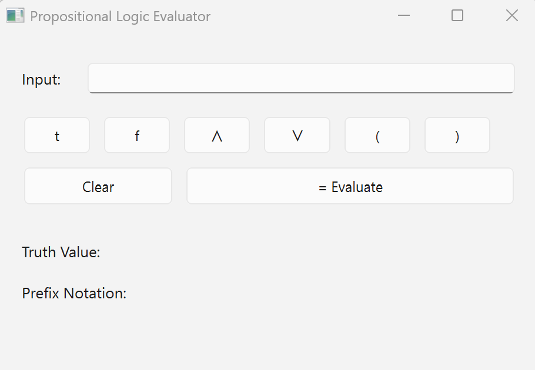
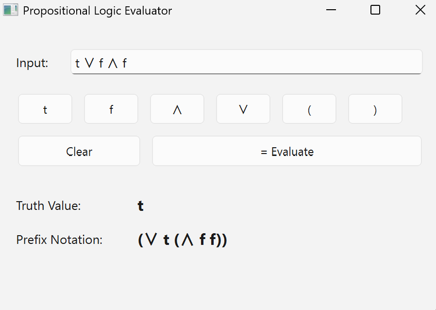
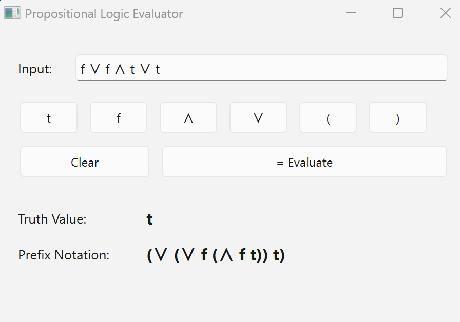
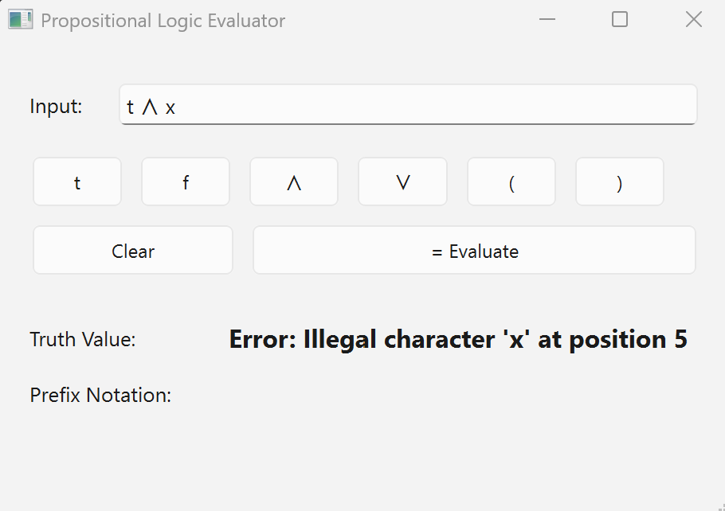

<h1 align="center">Propositional Logic Evaluator</h1>

<p align="center">
  <strong>Assignment 1</strong> — Programming Language and Compiler (PLC) course @ AIT
  <br/>
  January 2026
</p>

<p align="center">
  =3.10"/>
  
  
  
</p>

---

> **Author:** Aye Khin Khin Hpone (Yolanda Lim) — st125970

---

## Table of Contents

- [Table of Contents](#table-of-contents)
- [Overview](#overview)
- [Features](#features)
- [Grammar Specification](#grammar-specification)
- [How It Works](#how-it-works)
- [Project Structure](#project-structure)
- [Component Details](#component-details)
  - [`components/lexica.py` — Lexer](#componentslexicapy--lexer)
  - [`components/parsers.py` — Parser](#componentsparserspy--parser)
  - [`components/ast/statement.py` — AST Nodes](#componentsaststatementpy--ast-nodes)
  - [`components/ui.py` — GUI Layout](#componentsuipy--gui-layout)
  - [`main.py` — Entry Point](#mainpy--entry-point)
- [Tech Stack](#tech-stack)
- [Getting Started](#getting-started)
  - [Prerequisites](#prerequisites)
  - [Installation](#installation)
  - [Running](#running)
- [Examples](#examples)
- [Demo](#demo)
- [Screenshots](#screenshots)

---

## Overview

A desktop propositional logic evaluator that takes expressions built from **truth values** (`t`, `f`) and **logical operators** (`∧` and, `∨` or), then produces:

1. **Truth value** — the evaluated result (`t` or `f`)
2. **Prefix notation** — an equivalent expression in prefix (Polish) form

The evaluator uses a full **compiler front-end pipeline**: lexical analysis → parsing → AST construction → evaluation / translation, powered by the [SLY](https://github.com/dabeaz/sly) library (an LALR(1) parser generator).

---

## Features

| Feature | Description |
|---|---|
| **Two logical operators** | `∧` (and) with higher precedence, `∨` (or) with lower precedence |
| **Dual input modes** | Accepts both Unicode (`∧` `∨`) and ASCII (`&` `\|`) operators |
| **Parenthesised grouping** | Override default precedence with `(` `)` |
| **Prefix notation output** | Translates infix expressions to fully parenthesised prefix form |
| **Interactive GUI** | Qt6-based interface with clickable buttons for all symbols |
| **Error handling** | Graceful handling of invalid input with user-friendly error messages |

---

## Grammar Specification

The evaluator implements the following **context-free grammar**:

```
statement → expr

expr      → expr OR expr        (left-associative, precedence 1)
          | expr AND expr       (left-associative, precedence 2 — binds tighter)
          | LPAREN expr RPAREN
          | TRUE
          | FALSE
```

**Token definitions:**

| Token    | Pattern           | Description                 |
|----------|-------------------|-----------------------------|
| `TRUE`   | `t`               | Truth value true            |
| `FALSE`  | `f`               | Truth value false           |
| `AND`    | `∧` or `&`        | Logical conjunction         |
| `OR`     | `∨` or `\|`       | Logical disjunction         |
| `LPAREN` | `(`               | Left parenthesis            |
| `RPAREN` | `)`               | Right parenthesis           |

**Operator precedence** (higher number = binds tighter):

| Level | Operator | Associativity |
|:-----:|:--------:|:-------------:|
| 2     | `∧` AND  | Left          |
| 1     | `∨` OR   | Left          |

---

## How It Works

The program follows a classic **compiler front-end pipeline**:

```
┌─────────┐     ┌────────┐     ┌─────────┐     ┌────────────────────┐
│  Input   │────▶│ Lexer  │────▶│ Parser  │────▶│   AST Evaluation   │
│ (string) │     │(tokens)│     │ (tree)  │     │ run()  + prefix()  │
└─────────┘     └────────┘     └─────────┘     └────────────────────┘
```

**Step-by-step for `t ∨ f ∧ f`:**

1. **Lexer** tokenises the input string:
   ```
   TRUE  OR  FALSE  AND  FALSE
   ```

2. **Parser** builds an AST respecting operator precedence (`∧` binds tighter):
   ```
        ∨
       / \
      t    ∧
          / \
         f   f
   ```

3. **Evaluation** (`run()`) walks the tree bottom-up:
   - `f ∧ f` → `f`
   - `t ∨ f` → `t`

4. **Translation** (`prefix()`) converts to prefix notation:
   - `(∨ t (∧ f f))`

---

## Project Structure

```
src/125970eval/
│
├── main.py                       # Entry point — GUI + pipeline wiring
│
└── components/
    ├── lexica.py                 # Lexical analyser (tokeniser)
    ├── parsers.py                # LALR(1) parser (AST builder)
    ├── ui.py                     # PySide6 GUI layout
    │
    └── ast/
        └── statement.py          # AST node classes
```

---

## Component Details

### `components/lexica.py` — Lexer

`PropLogicLexer` extends `sly.Lexer` and tokenises the input string into six token types: `TRUE`, `FALSE`, `AND`, `OR`, `LPAREN`, `RPAREN`.

- Supports **Unicode** (`∧` `∨`) and **ASCII** (`&` `|`) operator input
- Skips whitespace and tabs
- Raises `ValueError` on illegal characters with their position

### `components/parsers.py` — Parser

`PropLogicParser` extends `sly.Parser` using the **LALR(1)** parsing algorithm.

- Declares **operator precedence** so `∧` binds tighter than `∨`
- Contains **6 grammar rules** that build AST nodes from the token stream
- Generates a `parser.out` debug file for grammar inspection

### `components/ast/statement.py` — AST Nodes

Three classes form the abstract syntax tree:

| Class | Role | Key Methods |
|---|---|---|
| `Expression` | Abstract base class | `run()`, `prefix()` |
| `Expression_bool` | Leaf node — holds a truth value (`True`/`False`) | `run()` → `bool`, `prefix()` → `"t"` or `"f"` |
| `Expression_logic` | Binary node — holds an operation + two children | `run()` → evaluates recursively, `prefix()` → `"(op left right)"` |

The `Operations` enum defines `AND = 0` and `OR = 1`.

### `components/ui.py` — GUI Layout

`Ui_MainWindow` defines the Qt6 interface with:

- **Input field** — text box for the expression
- **Symbol buttons** — `t`, `f`, `∧`, `∨`, `(`, `)`
- **Action buttons** — Clear (reset all fields), Evaluate (run pipeline)
- **Output labels** — Truth Value, Prefix Notation

### `main.py` — Entry Point

`MainWindow` extends `QMainWindow` and wires everything together:

- Button clicks append symbols to the input field
- **Evaluate** creates a fresh lexer + parser, feeds the input through the pipeline, and displays both outputs
- Errors (syntax errors, invalid input) are caught and shown in the Truth Value label

---

## Tech Stack

| Component | Technology | Purpose |
|---|---|---|
| Language | Python ≥ 3.10 | Core implementation |
| Lexer/Parser | [SLY](https://github.com/dabeaz/sly) | LALR(1) lexer and parser generator |
| GUI Framework | [PySide6](https://doc.qt.io/qtforpython-6/) (Qt6) | Desktop graphical interface |
| Package Manager | [uv](https://docs.astral.sh/uv/) | Fast dependency management & virtual env |

---

## Getting Started

### Prerequisites

- **Python ≥ 3.10**
- [**uv**](https://docs.astral.sh/uv/getting-started/installation/) package manager

### Installation

```sh
# Clone the repository
git clone <repository-url>
cd 125970-Assignment-1-Propositional-Logic-Evaluator-PLC

# Install all dependencies (creates .venv automatically)
uv sync
```

### Running

**Option 1 — VS Code (recommended):**

Press <kbd>F5</kbd> to launch using the `[125970eval] Python Debugger` configuration.

**Option 2 — Terminal:**

```sh
cd src/125970eval
uv run main.py
```

---

## Examples

| Input | Truth Value | Prefix Notation | Explanation |
|:------|:---:|:---|:---|
| `t` | `t` | `t` | Single true literal |
| `f` | `f` | `f` | Single false literal |
| `t ∧ f` | `f` | `(∧ t f)` | true AND false = false |
| `t ∨ f` | `t` | `(∨ t f)` | true OR false = true |
| `t ∨ f ∧ f` | `t` | `(∨ t (∧ f f))` | `∧` binds first: `f∧f = f`, then `t∨f = t` |
| `(t ∨ f) ∧ f` | `f` | `(∧ (∨ t f) f)` | Parentheses override: `t∨f = t`, then `t∧f = f` |

---

## Demo

<p align="center">
  
  <br/>
  <em>Animated walkthrough of the Propositional Logic Evaluator.</em>
</p>

<p align="center">
  <a href="https://youtu.be/jVUvnhstTXY">
    
  </a>
</p>

---

## Screenshots

<table>
  <tr>
    <td align="center"><br/><b>Empty GUI on launch</b></td>
    <td align="center"><br/><b>Operator precedence: <code>t ∨ f ∧ f → t</code></b></td>
  </tr>
  <tr>
    <td align="center"><br/><b>Left-associativity: <code>f ∨ f ∧ t ∨ t → t</code></b></td>
    <td align="center"><br/><b>Error handling: illegal character <code>x</code></b></td>
  </tr>
</table>
